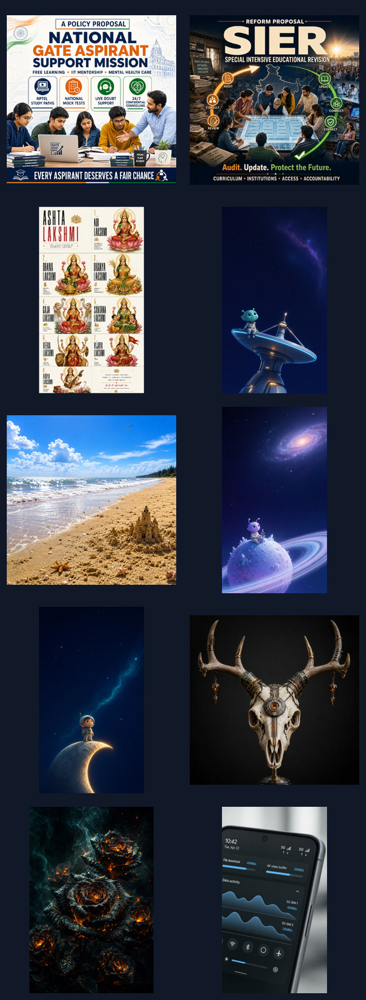
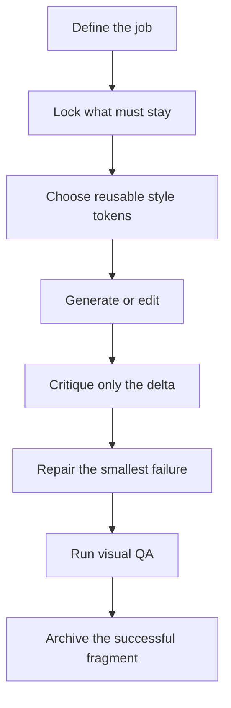

# Human-Directed Visual Workflows

A public portfolio of repeatable AI image direction, editing controls, prompt fragments, failure repair, and honest human-AI authorship by [`maitranilim`](https://github.com/maitranilim).

This is not a gallery presented as hand-made illustration. It is a workflow repository for AI artists, product marketing teams, and designers who need more control, less drift, and reusable art direction.

## Recruiter quick scan

If you have three minutes:

1. Read [what `maitranilim` contributed](docs/HUMAN-CONTRIBUTION.md).
2. Review the [repeatable workflow](docs/WORKFLOW.md).
3. Inspect [preservation locks](prompt-library/preservation-locks.md) and the [delta-edit loop](workflows/delta-edit-loop.md).
4. Open the [failure catalog](failures/README.md).
5. Browse the [experiment categories](experiments/README.md) and their selected outputs.

## The pitch

One-shot prompting is hard to debug. This repository turns visual generation into a controlled loop:

The system is designed to reduce:

- unnecessary regenerations;
- accidental changes to composition or identity;
- time spent rewriting successful prompt language;
- over-editing when only one local change was requested;
- repeated failure modes that should have become reusable constraints.

## What is pitchable now

| Asset | Why another team can use it |
|---|---|
| Preservation-lock library | Turns “keep it the same” into explicit, testable invariants |
| Prompt-fragment taxonomy | Reuses style, composition, typography, color, and finish independently |
| Delta-edit loop | Keeps critiques local and makes repairs easier to evaluate |
| Failure catalog | Converts bad generations into negative requirements |
| Quality rubric | Gives designers and marketers a shared review vocabulary |
| Experiment log | Separates observed outputs from unmeasured efficiency claims |
| Human-AI contribution model | Credits direction and evaluation without claiming manual image creation |

## Experiment categories

| Category | Main question | Selected evidence |
|---|---|---:|
| [Realistic photo editing](experiments/realistic-photo-editing/) | Can the edit feel natural while preserving scene identity? | 1 non-personal scene |
| [Posters and public causes](experiments/posters-public-causes/) | Can hierarchy, cause, and cultural tone coexist? | 3 outputs |
| [Profile, banners, and branding](experiments/profile-banners-branding/) | Can a compact visual identity survive across dark editorial styles? | 2 outputs |
| [Wallpapers and worldbuilding](experiments/wallpapers-worldbuilding/) | Can a visual motif produce a coherent family without repetition? | 3 outputs |
| [Memes and template preservation](experiments/memes-template-preservation/) | Can one element change while the recognized template remains intact? | Text-only public sample |
| [UI and OS concepts](experiments/ui-os-concepts/) | Can a visual brief communicate a product interaction before implementation? | 1 output |

Personal photographs are intentionally excluded. Third-party meme templates are not redistributed.

## What `maitranilim` did

- Chose the visual problem, audience, and acceptance bar.
- Supplied and refined composition, realism, mood, and preservation requirements.
- Identified failures such as face drift, camera-angle drift, aspect-ratio drift, artificial saturation, and non-local edits.
- Introduced reproducible visual ideas that were reused in later outputs.
- Selected successful prompt fragments and organized them into a modular vocabulary.
- Compared outputs, rejected failures, and decided what was worth preserving.
- Set privacy boundaries and curated the public sample set.

The professional vocabulary includes **multimodal art direction**, **prompt systems design**, **reference-preserving editing**, **iterative supervision**, **evaluation design**, **model behavior shaping**, **workflow design**, and **curation**.

## What the AI did

ChatGPT and image-generation models performed substantial visual synthesis and editing. Codex helped reconstruct, organize, document, and validate the public workflow. The images are presented as AI-generated or AI-edited outputs, not as manually illustrated work by `maitranilim`.

## Efficiency evidence

The user-observed benefits are:

- fewer regenerations;
- faster completion;
- reuse of successful prompt fragments.

Those benefits are credible qualitative findings from repeated use, but historical iteration counts and elapsed times were not recorded consistently. The [measurement protocol](benchmarks/measurement-protocol.md) starts a prospective baseline. No percentage or cost-saving claim is made yet.

## Repository map

| Path | Purpose |
|---|---|
| [`prompt-library/`](prompt-library/) | Modular prompt fragments and preservation constraints |
| [`workflows/`](workflows/) | Repeatable operating procedures |
| [`experiments/`](experiments/) | Category folders, case notes, and selected outputs |
| [`failures/`](failures/) | Failure signatures and minimal repairs |
| [`benchmarks/`](benchmarks/) | Honest experiment log and measurement method |
| [`source-notes/`](source-notes/) | Preserved source notes before restructuring |
| [`contribution-log/`](contribution-log/) | Human directions that changed model behavior |

## License and rights

Code and software-like templates are MIT licensed. Original documentation and prompt systems are offered under CC BY 4.0 to the extent that `maitranilim` controls the applicable rights. AI-generated outputs, third-party marks, cultural subjects, and source-image rights need additional care. See [LICENSING.md](LICENSING.md) and [privacy and rights](docs/PRIVACY-AND-RIGHTS.md).
