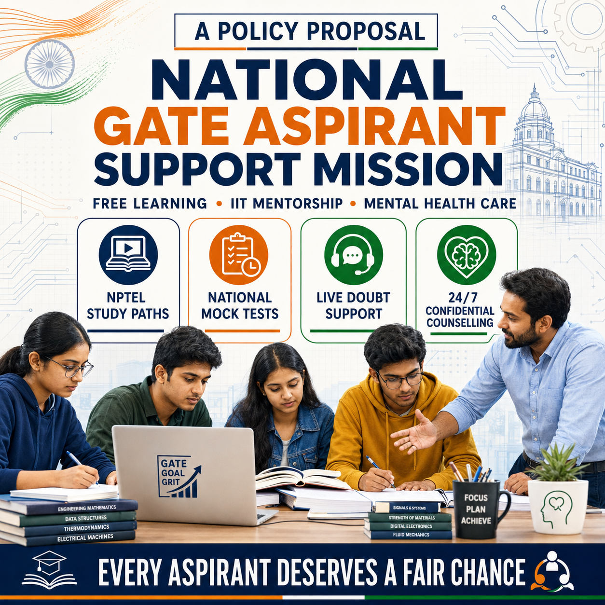
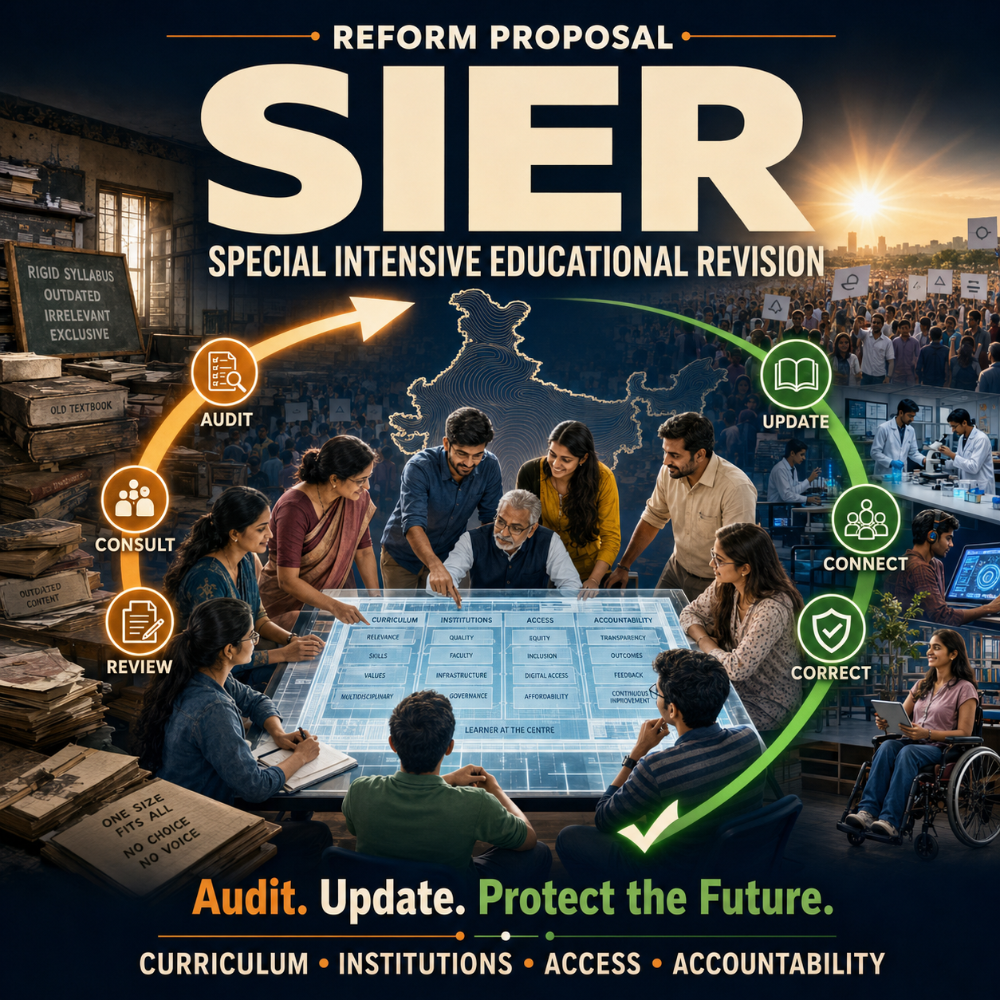
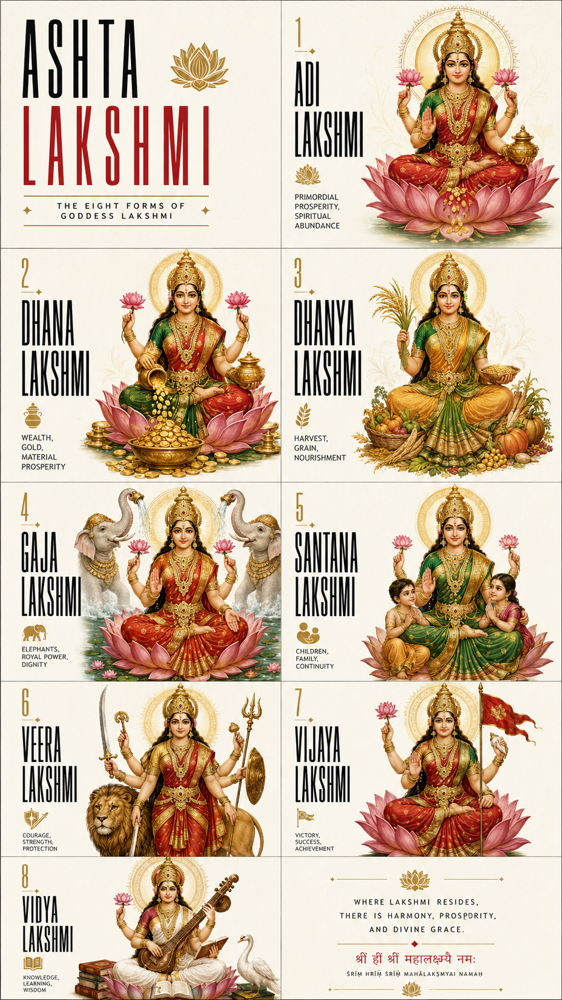

# Posters and public causes

## Goal

Translate an education or cultural idea into a strong, readable concept poster.

## Public samples

### GATE Aspirant Support Mission

Strengths: clear top-level cause, central group, service pillars, and public-policy tone.

Risks: organizational marks, program names, and fine print require factual and rights review. This is a concept image, not evidence of institutional endorsement.

### SIER education reform

Strengths: large title hierarchy, system-level narrative, and visual connection between institutions, process, and people.

Risks: the policy name and copy require verification before any real campaign use.

### Eight forms of Lakshmi in Swiss style

Strengths: a disciplined editorial grid applied to a cultural subject.

Risks: image models are unreliable at fine text and may misstate cultural or religious details. A qualified cultural review and deterministic typesetting are required.

## Reusable workflow

1. State the cause in one sentence.
2. Choose one audience action or emotional takeaway.
3. Reserve deterministic copy zones.
4. Use the image model for visual hierarchy and concept exploration.
5. Verify facts, names, symbols, and affiliations.
6. Rebuild final type and logos in a conventional design tool.

## Evidence status

- Outputs available: three.
- Exact historical prompts: incomplete.
- Campaign performance: unmeasured.
- Factual, cultural, and trademark clearance: not established.
