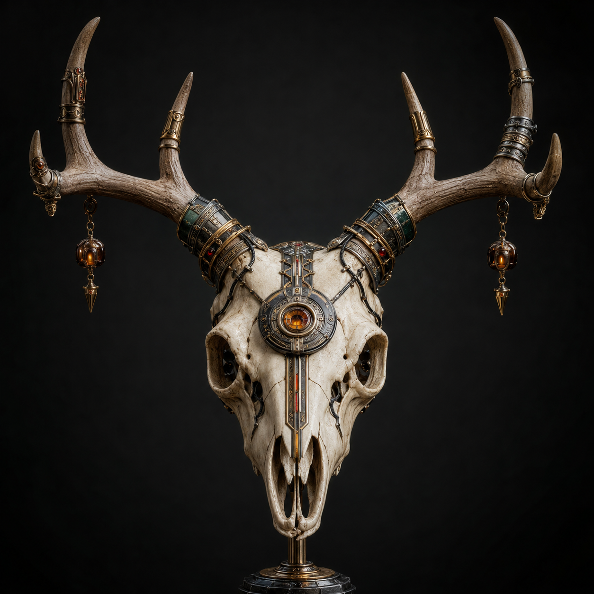
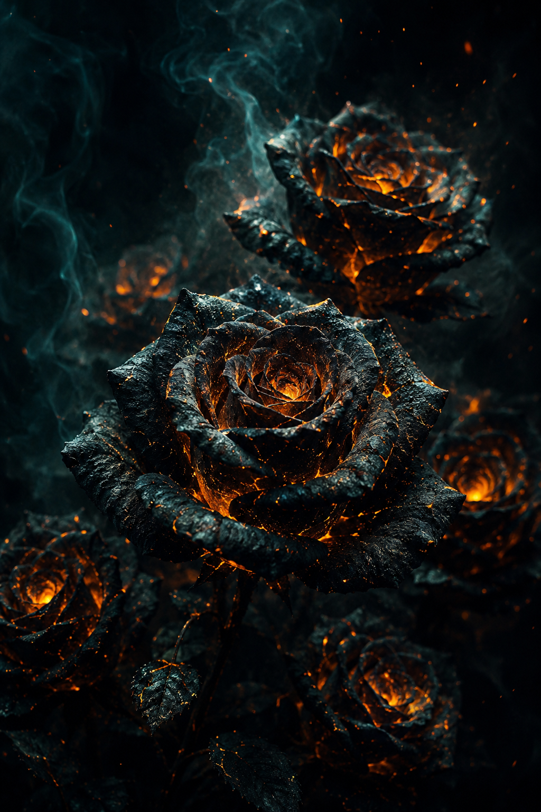

# Profile, banners, and branding

## Goal

Create recognizable symbols and material systems that can support a profile image, banner, cover, or campaign mood.

## Public samples

### Cyberpunk deer skull

The image demonstrates a strong central silhouette, mechanical ornament, material contrast, and a neutral background suitable for identity use.

### Emberlit black roses

The image demonstrates a compact palette system: near-black botanical form, ember-orange internal light, and teal atmospheric separation.

## Reusable controls

- one recognizable symbol;
- silhouette readable at small size;
- one primary material and one contrasting material;
- two-color relationship plus neutral;
- texture that supports the identity rather than obscuring it;
- crop variants planned from the start;
- no reliance on tiny generated text.

## Honest claim

These are AI-generated outputs selected and directed by `maitranilim`. They show art direction and curation, not manual illustration or a completed brand strategy.

## Evidence status

- Outputs available: two.
- Cross-channel deployment: not recorded.
- Brand recall or performance: unmeasured.
