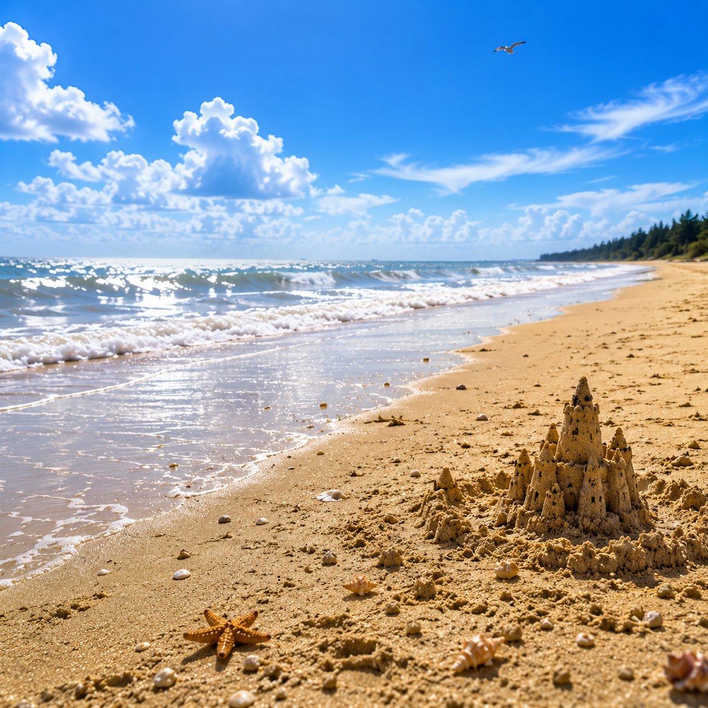

# Realistic photo editing

## Goal

Make an image feel improved but not visibly “AI-polished.” Preserve the original scene logic and camera credibility.

## Human direction pattern

`maitranilim` repeatedly preferred:

- believable texture;
- restrained saturation;
- lower highlight intensity;
- mild dehaze and contrast;
- source-matched sharpness and noise;
- light vignetting rather than dramatic relighting;
- preservation of the original angle, composition, and important background anchors.

For portrait work, identity, skin tone, face structure, and expression were treated as locks. Personal portrait evidence is intentionally not published.

## Public sample

This non-personal scene is included as a naturalism and curation sample. The exact historical prompt and any original source are not asserted here.

## Reusable workflow

1. Lock camera, crop logic, subject placement, and scene anchors.
2. Describe corrections as ranges: mild, restrained, subtle.
3. Preserve noise and texture consistent with the source device.
4. Review at normal viewing size and at 100 percent.
5. Reject if the result looks more “generated” than the source.

## Evidence status

- Output available: yes.
- Workflow reconstructed: yes.
- Before-and-after source public: no.
- Iteration and time metrics: unmeasured.
