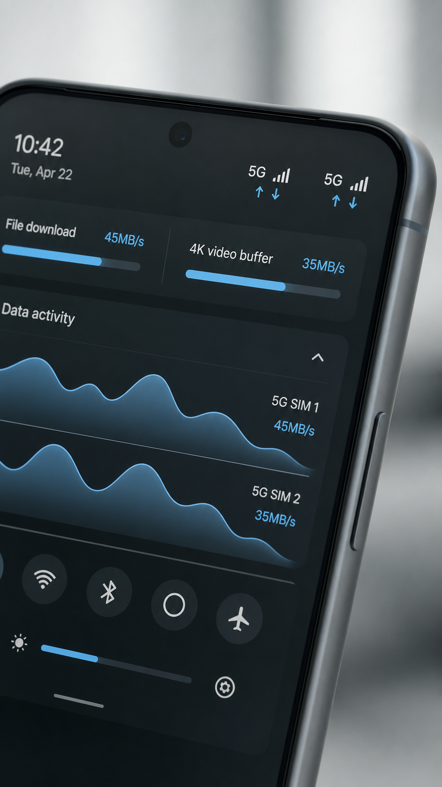

# UI and OS concepts

## Goal

Use image generation to communicate a product interaction before implementation.

## Public sample

The concept places recent file-download and data-activity signals inside a mobile quick-settings surface. It communicates density, hierarchy, and a plausible glanceable interaction.

## What the image can validate

- whether the concept is visually understandable;
- rough information hierarchy;
- whether a macro view belongs in quick settings;
- mood and material direction;
- which states deserve a real prototype.

## What it cannot validate

- actual platform feasibility;
- accessibility;
- gesture behavior;
- performance;
- data accuracy;
- privacy controls;
- production typography and spacing.

## Reusable workflow

1. Write the user job and state transition.
2. Define what information must be understood in two seconds.
3. Generate a concept render.
4. Extract the interaction requirements.
5. Rebuild in a deterministic design or prototyping tool.
6. Test with users before implementation.

## Evidence status

- Concept output available: yes.
- Working UI: no.
- Usability evidence: no.
- Implementation effort: unmeasured.
