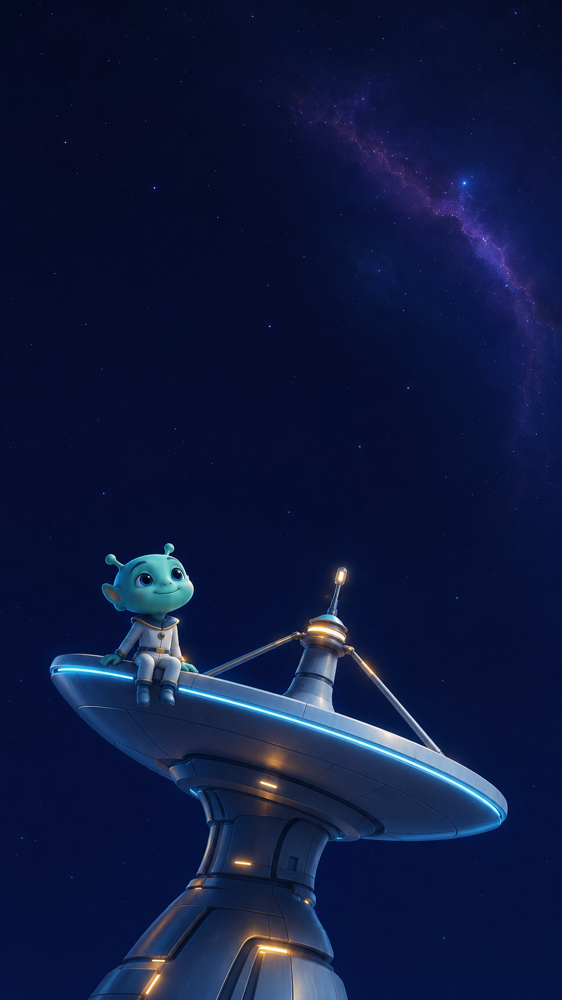
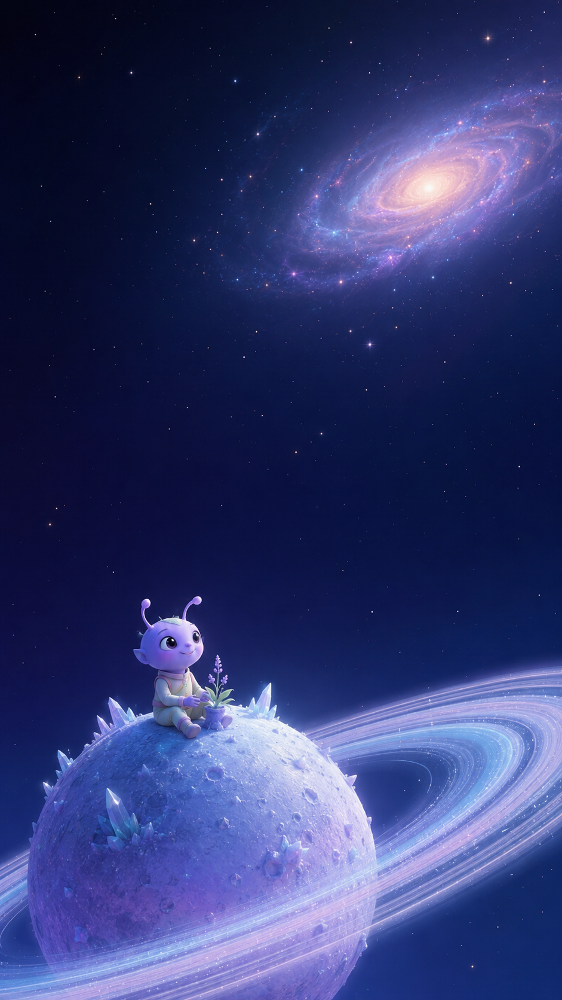
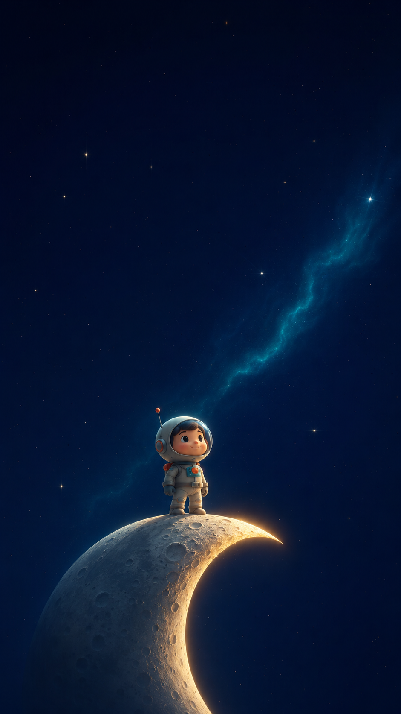

# Wallpapers and worldbuilding

## Goal

Build a coherent family of small characters in vast celestial environments without merely repeating one composition.

## Public samples

| Output | Visual role |
|---|---|
|  | Technology, height, and curiosity |
|  | Botanical character, ringed planet, violet palette |
|  | Crescent silhouette, solitude, navigational mood |

## Reusable world grammar

- small, readable character;
- one oversized celestial or technological anchor;
- large dark negative space;
- controlled cool palette with one local glow;
- vertical composition;
- simple silhouette before surface detail;
- quiet wonder rather than action clutter.

## Variation rule

Preserve the grammar, not the exact scene. Change at least three of:

- character role;
- anchor object;
- silhouette;
- planet or sky structure;
- local light source;
- dominant hue;
- camera height.

## Evidence status

- Outputs available: three.
- Visual-family coherence: inspectable.
- Exact prompt lineage: incomplete.
- Audience or wallpaper-use metrics: unmeasured.
